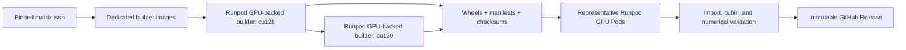

# SageAttention wheels for Runpod ComfyUI

This repository builds reproducible Linux x86-64 SageAttention wheels for the
exact Python, PyTorch, and CUDA stacks used by the Runpod ComfyUI base images.
Compilation runs on short-lived GPU-backed Pods, one CUDA variant at a time.
The compiler deliberately hides the attached GPU; representative NVIDIA GPU
Pods then validate the finished wheels before a release can be published. A
sized CPU Pod remains an explicit capacity fallback, not the default backend.

The factory is intentionally strict. A wheel is selected by the complete
runtime tuple—not merely by its Python wheel tag:

```text
SageAttention source + Python ABI + PyTorch version + CUDA variant + GPU cubins
```

## Initial compatibility matrix

| Variant | Python | PyTorch | Toolkit | Native GPU targets |
|---|---|---|---|---|
| `cu128` | CPython 3.12 | `2.10.0+cu128` | CUDA 12.8 | SM 80, 86, 89, 90a, 120 |
| `cu130` | CPython 3.12 | `2.10.0+cu130` | CUDA 13.0 | SM 80, 86, 89, 90a, 120 |

SageAttention 2.2.0 does not implement the SM10x paths used by B200 (SM100) and
B300 (SM103). Both are therefore deliberately excluded rather than advertised
based on an untested PTX fallback. The supported Blackwell target here is
SM120, validated on an RTX 5090; SM100, SM103, and SM120 are not
interchangeable.

Runpod scheduling uses reviewed, ordered lists of exact `gpuId` strings. A
builder may fall back across architectures because its accelerator is hidden;
each validation list is restricted to one exact compute capability. The
conservative defaults are A100 PCIe → A100 SXM → H100 PCIe → H100 SXM → H100
NVL → H200 → RTX 5090 → RTX PRO 6000 Blackwell Server for builders, with
same-capability runtime fallbacks for SM80, SM86, SM89, SM90, and SM120. Exact
IDs, ordering, source links, and live-catalog caveats are in
[`docs/runpod-orchestration.md`](docs/runpod-orchestration.md#ordered-gpu-candidates).
No MIG profile, B200, B300, or RTX PRO 6000 Max-Q is prefilled.

## Pipeline



GitHub Actions coordinates the work and retains the evidence. It does not run
NVCC and it does not promote an artifact before GPU validation succeeds.

## Why a downstream patch is necessary

Upstream SageAttention 2.2.0 applies one global CUDA architecture list to all
extensions. Its Hopper TMA/WGMMA source then gets compiled for older GPU
targets, which fails in `ptxas`. This repository gives each extension its own
safe native-SASS target list:

| Extension | Targets |
|---|---|
| `_qattn_sm80` | 80, 86, 89, 90a, 120 |
| `_qattn_sm89` | 89, 90a, 120 |
| `_qattn_sm90` | 90a only |
| `_fused` | 80, 86, 89, 90a, 120 |

## Build resources

The factory attaches a GPU because builders run on GPU Pods, but compilation
does not use it: `build-wheel.sh` exports `CUDA_VISIBLE_DEVICES=""`. NVCC needs
host-system CPU and RAM, not VRAM. The validated CUDA 12.8 build took 11 minutes
29 seconds with two concurrent extensions and two Ninja jobs per extension,
peaking at 29.65 GB of cgroup-accounted system memory.

Recommended GPU-backed builder assignment:

- 16 vCPUs;
- 64 GB system RAM recommended, 32 GB minimum, for the reviewed
  `MAX_JOBS=2` × `EXT_PARALLEL=1` default;
- 80 GB container storage (the automated factory minimum and default); the
  build preflight requires at least 20 GiB free on both the work and output
  filesystems; and
- an ordered exact-`gpuId` builder list beginning with
  `NVIDIA A100 80GB PCIe`, with every assigned Pod still required to pass the
  system-resource preflight.

The cu128 and cu130 builders run sequentially, and each keeps extension
parallelism at one. Smaller assignments can use serialized compiler jobs. The
build entrypoint obtains system limits from cgroups and lowers concurrency
rather than trusting host-wide `/proc/meminfo`, host CPU counts, or GPU VRAM.

## Safety properties

- Source tags and commits are both pinned and verified.
- CUDA 12.8 and CUDA 13.0 produce distinct downstream versions and manifests.
- The exact PyTorch dependency is present in wheel metadata.
- The installer refuses a CUDA/PyTorch mismatch or an ambiguous wheelhouse.
- CUDA driver stubs are link-time-only builder inputs.
- Every default GPU builder and validator receives an RFC3339 platform
  termination deadline, and every job also has retried `finally` cleanup. An
  in-Pod builder watchdog protects the explicit CPU fallback, whose
  provisioning path has no verified platform deadline.
- GPU-backed manifests record the exact selected builder candidate; CPU
  fallback manifests use a stable `null` GPU-identity field.
- Paid Pod workflows require an explicit dispatch/release gate.
- Release creation depends on all configured GPU tests passing.
- No global `LD_PRELOAD` is used by the resource-reporting shim.

## Repository map

- `matrix.json` — authoritative build and test matrix.
- `docker/` — dedicated GPU-backed builder images and scoped resource shim.
- `patches/` — reviewed downstream SageAttention build patches.
- `scripts/` — build, inspect, manifest, selection, and GPU validation tools.
- `tools/` — Runpod lifecycle and cgroup resource helpers.
- `.github/workflows/` — local CI, explicit builds, and gated releases.
- `docs/` — architecture, matrix, Runpod, and operations details.

## Local validation

The repository's non-GPU checks use only Python's standard library:

```bash
python3.12 -m unittest discover -s tests -v
python3.12 -m compileall scripts tools tests
```

Building a wheel requires one of the pinned builder images. Launching Pods and
publishing releases additionally requires the GitHub secrets documented in
`docs/runpod-orchestration.md`.

## Distribution rule

Do not combine all local CUDA/PyTorch variants into one unconstrained simple
package index. Standard wheel tags do not describe CUDA, PyTorch, or compute
capability. Consumers should use the selector with a release manifest or an
explicit variant-specific asset URL.

## Status

The CUDA 12.8 fat-wheel patch and RTX 4090 runtime path have been proven on a
live Runpod Pod; the measurements and limitations are recorded in
[`docs/cuda128-proof.md`](docs/cuda128-proof.md). Before the first public
release, the CUDA 13.0 variant and the remaining representative GPU families
must pass the same gated workflow.
